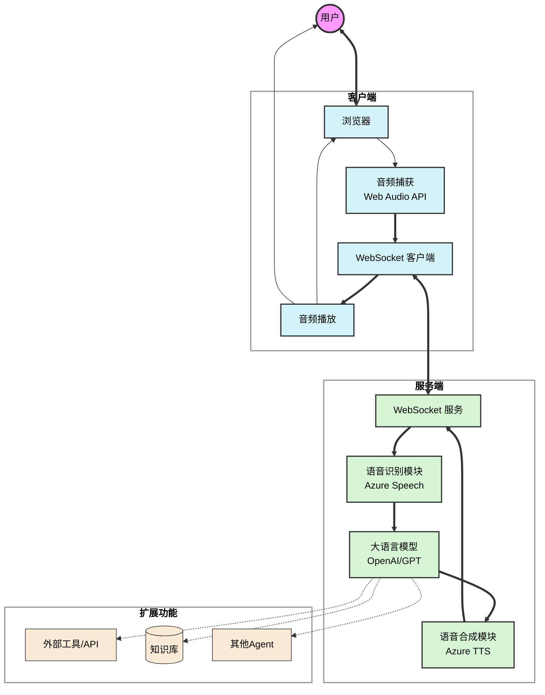

# 智能语音对话系统

基于现代Web技术构建的实时语音对话平台，无缝集成语音识别、大语言模型对话和高质量语音合成。

<div align="center">


[](https://github.com/chicogong/conversational-agents)
[](https://developer.mozilla.org/en-US/docs/Web/API/WebSocket)
[](https://github.com/chicogong/conversational-agents)
[](https://nodejs.org/)
[](LICENSE)
[](CONTRIBUTING.md)

</div>

<div align="center">

[](https://github.com/chicogong/conversational-agents/stargazers)
[](https://github.com/chicogong/conversational-agents/network/members)

</div>

## 🔍 概述

本项目实现一个完整的语音对话助手，支持实时语音识别、LLM对话和高质量TTS合成，具有低延迟和高响应性特点。系统采用模块化设计，易于维护和扩展。

**核心特性:**

- 🎤 实时语音识别：支持连续语音识别，自动断句
- 🤖 智能对话：集成大语言模型，提供智能对话能力
- 🚀 实时交互：支持打断和实时响应
- 🔊 语音合成：将AI回复转换为自然语音
- 📝 会话管理：支持多轮对话历史记录
- 🔄 可扩展性：易于集成其他AI服务和功能
- 🌟 低延迟设计，接近自然对话体验

## 📋 系统要求

- Node.js 16+ 和 npm/yarn
- Azure 语音服务账户
- OpenAI API 账户（或兼容API）
- 支持WebSocket和AudioContext的浏览器

## 🚀 快速开始

### 安装

```bash
# 克隆仓库
git clone https://github.com/chicogong/conversational-agents.git
cd conversational-agents

# 安装依赖
npm install
```

### 配置

创建 `.env` 文件并配置以下参数:

```
# Azure语音服务
AZURE_SPEECH_KEY=your_key_here
AZURE_SPEECH_REGION=your_region_here

# OpenAI
OPENAI_API_KEY=your_openai_key_here
OPENAI_BASE_URL=https://api.openai.com/v1  # 可选
OPENAI_MODEL=gpt-3.5-turbo  # 可选
```

### 启动

```bash
npm start
```

访问 `http://localhost:8080` 开始使用。

## 🔌 技术架构

本系统采用模块化设计，主要组件包括:

### 系统架构图



### 后端架构

- **服务器核心**: Node.js + Express
- **WebSocket服务**: 用于实时音频传输和双向通信
- **语音服务**: 集成Azure语音识别和合成
- **LLM服务**: 接入OpenAI或兼容API，提供对话能力

### 前端架构

- **音频捕获**: Web Audio API
- **实时通信**: WebSocket客户端
- **用户界面**: 原生JavaScript + 现代CSS

### 系统性能

- ASR延迟：< 300ms
- LLM首token延迟：< 300ms
- TTS首帧延迟：< 300ms
- 端到端延迟：< 1000ms

## 🚀 扩展功能

### 1. 多语言支持
- 支持多种语言的语音识别和合成
- 自动检测用户语言
- 跨语言对话能力

### 2. 上下文管理
- 对话历史记录
- 上下文感知
- 个性化对话风格

### 3. 高级功能
- 情感识别
- 语音情感合成
- 多轮对话优化
- 知识库集成

## 🛠️ API规范

### WebSocket消息格式

**客户端到服务器:**
- 音频数据流
- 控制命令 (打断、重置等)

**服务器到客户端:**
- 识别结果(部分/完整)
- LLM响应内容
- TTS音频数据
- 状态信息和错误提示

### 详细通信协议

#### 连接建立
```
WebSocket URL: ws://{host}:{port}/speech
```

#### 客户端消息类型
1. **音频数据**:
```json
{
  "type": "audio",
  "format": "audio/webm",
  "data": "base64编码的音频数据"
}
```

2. **控制命令**:
```json
{
  "type": "command",
  "command": "interrupt" | "reset" | "pause" | "resume"
}
```

#### 服务器消息类型
1. **ASR识别结果**:
```json
{
  "type": "asr_result",
  "text": "识别文本",
  "isFinal": true | false
}
```

2. **LLM响应**:
```json
{
  "type": "llm_response",
  "text": "回复文本",
  "isComplete": true | false
}
```

3. **TTS音频**:
```json
{
  "type": "tts_audio",
  "format": "audio/mp3",
  "data": "base64编码的音频数据",
  "isLast": true | false
}
```

4. **状态消息**:
```json
{
  "type": "status",
  "status": "ready" | "processing" | "error",
  "message": "状态描述或错误信息"
}
```

#### 状态码
- 1000: 正常关闭
- 1001: 服务重启
- 1011: 服务器内部错误
- 4000: 无效的消息格式
- 4001: 认证失败
- 4002: 服务限流

## 📊 性能优化

系统针对语音交互场景进行了多项优化:

- 实时语音活动检测
- 语音识别的断句优化
- LLM流式响应及句子级TTS合成
- 打断机制优化
- 网络连接自动恢复

## 🔄 Docker部署

### 使用Docker Compose运行

```bash
# 构建并启动容器
docker-compose up -d
```

### 手动Docker构建

```bash
# 构建镜像
docker build -t conversational-agent .

# 运行容器
docker run -p 8080:8080 \
  -e AZURE_SPEECH_KEY=your_key \
  -e AZURE_SPEECH_REGION=your_region \
  -e OPENAI_API_KEY=your_key \
  conversational-agent
```

## 📅 开发路线图

### 短期计划
- [ ] 添加对话历史记录
- [ ] 添加错误重试机制
- [ ] 接入更多LLM提供商
- [ ] 接入更多TTS（Minimax等）提供商
- [ ] 增加协议的扩展性
- [ ] 接入MCP扩展工具调用
- [ ] 接入A2A协议实现多Agent等
- [ ] 优化打断速度
- [ ] 增加Agent状态、会话状态回调

### 近期计划
- 多语言支持增强
- 多模型接入和切换功能
- 会话历史管理
- 对话风格定制
- 工具调用能力

### 未来展望
- 自定义语音模型
- 情感识别与表达
- 多Agent协作交互
- 跨平台客户端支持
- 嵌入式设备支持

## 🤝 贡献指南

欢迎提交 Pull Request 或创建 Issue！

1. Fork 项目
2. 创建特性分支 (`git checkout -b feature/AmazingFeature`)
3. 提交更改 (`git commit -m 'Add some AmazingFeature'`)
4. 推送到分支 (`git push origin feature/AmazingFeature`)
5. 创建 Pull Request


## 📄 许可协议

本项目采用 MIT 许可证 - 详见 [LICENSE](LICENSE) 文件

## 📞 联系方式

- 项目维护: [chicogong](https://github.com/chicogong)
- 邮箱: chicogong@tencent.com

---

<div align="center">
  <sub>Built with ❤️ by <a href="https://github.com/chicogong">chicogong</a></sub>
</div> 